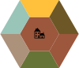

#  Dörfer Spielregeln

Dörfer ist ein Aufbaustrategie-/Legespiel für 1-4 Spieler, in dem man durch das Platzieren von sechseckigen Kärtchen eine Dorflandschaft baut.

[TOC]

## Spielanfang / Spielkonfiguration

Das Spiel startet mit einem endlichen Stapel von zufällig generierten Landschaftskärtchen. Die genaue Größe des Stapels und mit welchen Wahrscheinlichkeitsgewichtungen die Kärtchen generiert werden wird von der Spielkonfiguration gegeben.

Auf dem Spielbrett befindet sich für jeden Spieler mindestens eine vorplatzierte Karte. Der Startzustand des Spielbretts ist von der Spielkonfiguration gegeben.

Es können auch vorplatzierte Karten auf dem Spielbrett existieren, welche keinem Spieler zugeordnet sind.
(Ob die vorplatzierten Karten zusammenpassen müssen oder nicht, ist nicht definiert.)

Es werden die ersten _\<Spieleranzahl\>+1_ Karten vom Stapel nacheinander aufgedeckt.

## Spielablauf

Die Spieler sind nacheinander reihum am Zug.

Der Spieler, der am Zug ist, nimmt die älteste aufgedeckte Karte vom Stapel und platziert diese auf dem Spielbrett nach den folgenden Regeln:
- Die Karte kann nur auf ein noch freies Feld gelegt werden.
- Die Karte muss an mindestens eine andere Karte angelegt werden, welche der Spieler bereits in einem vorherigen Zug platziert hatte.
- An jedere Seite der Karte, wo eine andere Karte anliegt, dürfen nur kompatible Biome zu dem Biom der entsprechenden Seite sein.
- Die Karte darf gedreht werden.

Nachdem der Spieler die Karte platziert hat, wird eine neue Karte vom Stapel aufgedeckt.

Falls es für den Spieler unmöglich ist die Karte zu platzieren, wird er übersprungen. In diesem Fall bleibt der Stapel, die aufgedeckten Karten und das Spielbrett unverändert.

## Spielende
Das Spiel endet, wenn einer der folgenden Fälle eintritt:
- Alle Karten aus dem Stapel wurden auf dem Spielbrett platziert.
- Es ist für alle Spieler unmöglich die aktuelle Karte zu platzieren.

Der/die Spieler mit den meisten Punkten hat/haben gewonnen.

## Biome

Es existieren die folgenden Biomarten:
- Häuser: 
- Grünland: 
- Wald: 
- Acker: 
- Zugstrecke: 
- Wasser: 

### Kompatibilität

Alle Biome sind mit sich selbst und miteinander kompatibel, mit den folgenden Ausnahmen:
- Wasser ist nur mit Wasser kompatibel.
- Zugstrecke ist nur mit Zugstrecke kompatibel.

## Karten

Eine Karte ist ein [Sechseck](https://www.youtube.com/watch?v=thOifuHs6eY) mit sechs Kanten und einem Mittelpunkt.

Jeder Kante ist ein Biom zugeordnet.

Das Biom des Mittelpunktes wird nach der ersten zutreffenden Regel bestimmt:
1. Zugstrecke, falls mindestens eine der Kanten eine Zugstrecke ist.
2. Das Biom welches am häufigsten auf der Karte auftritt, sofern dies eindeutig ist.
3. Wasser, falls eines der am häufigsten auftretenden Biome auf der Karte Wasser ist.
4. Grünland, falls eines der am häufigsten auftretenden Biome auf der Karte Grünland ist.
5. Wald, falls eines der am häufigsten auftretenden Biome auf der Karte Wald ist.
6. Häuser, falls eines der am häufigsten auftretenden Biome auf der Karte Häuser ist.
7. Acker.

### Beispiele

Beispiele für Karten sind [hier in der Implementierungshilfe](./IMPLEMENTIERUNGSHILFE.md#beispiel-spielverlauf).

## Spielbrett

Das Spielbrett ist unendlich groß und besteht aus einem Gitter(Grid) in dem sich die Karten flächendeckend aneinander legen lassen.

## Punkte

Ein Spieler erhält für jede abgeschlossene Biomfläche, an der er beteiligt ist, _(n\*A)+floor(A^1.5)_ Punkte, wobei _A_ die Größe der Biomfläche und _n_ die Anzahl der an der Biomfläche beteiligten Spielern ist. Die  _floor()_ Funktion rundet ab (z.B. _floor(5^1.5)==11_ ). Der Operator _^_ ist hier der Potenzoperator.

Für die Punkteberechnung zählen auch die zum Spielanfang vorplatzierten Karten, welche keinem Spieler zugeordnet sind, als Karten des "Spielbrett Spielers", welcher entsprechend auch als beteiligter Spieler zählt.

### Biomfläche

Eine Biomfläche ist eine Menge an inter-/intra-kartenzusammenliegenden Biomen der selben Biomart auf dem Spielbrett.

Eine Biomfläche gilt als *abgeschlossen*, sobald an allen Seiten der Biomfläche ein anderes als das eigene Biom anliegt.

Die *Größe einer Biomfläche* ist die Anzahl an **inter**kartenzusammenliegenden Biome in der Biomfläche.

Ein Spieler gilt als *beteiligt*, wenn er mindestens eine der Karten platziert hat, welche einen Teil der Biomfläche beinhaltet.

Begriffserklärung:
- Intrakartenzusammenliegende Biome sind Biome, die in einer Karte drinne direkt aneinanderliegen.
- Interkartenzusammenliegende Biome sind Biome, die zwischen zwei Karten direkt aneinanderliegen.

### Beispiel

Ein Beispiel für eine Biomfläche mit Punkteberechnung ist [hier in der Implementierungshilfe](./IMPLEMENTIERUNGSHILFE.md#beispiel-punkteberechnung).

## Inspiration

Das Spielprinzip und die Spielidee sind stark von den Spielen [Dorfromantik (2022)](https://toukana.com/dorfromantik/) und [Carcassonne](https://de.wikipedia.org/wiki/Carcassonne_(Spiel)) inspiriert.
